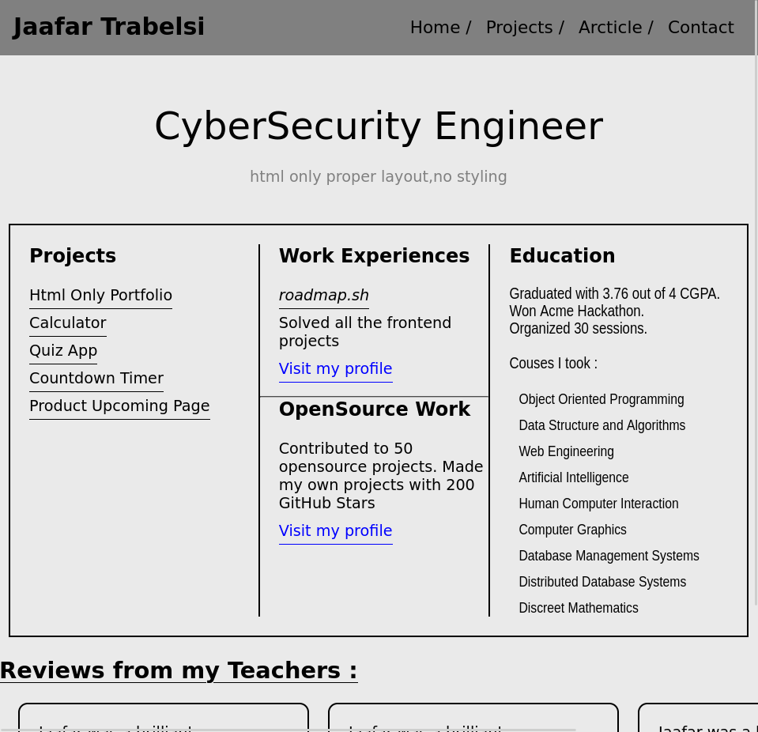
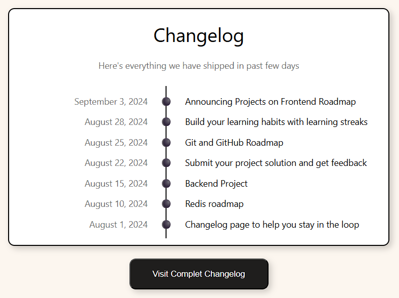
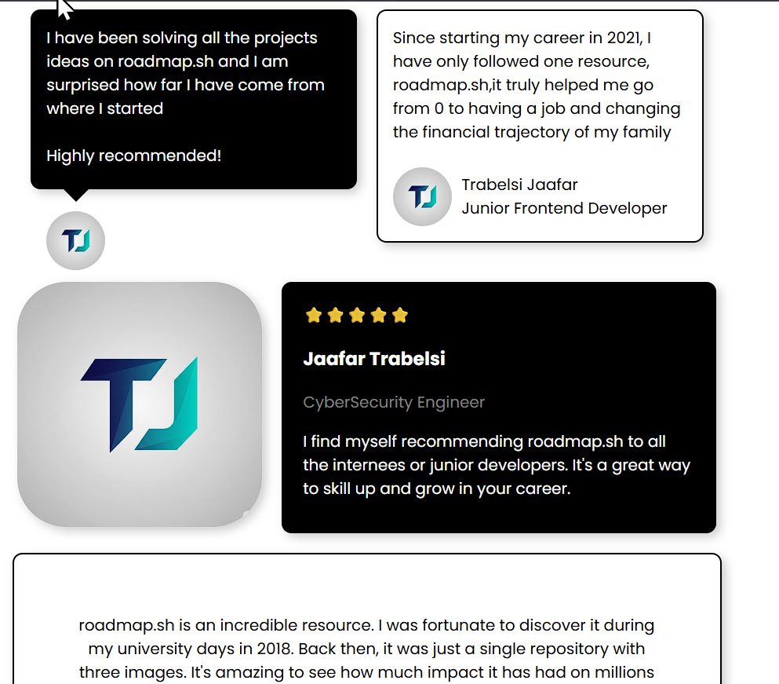
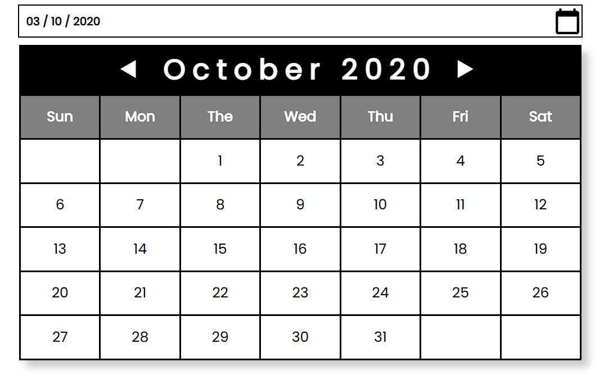
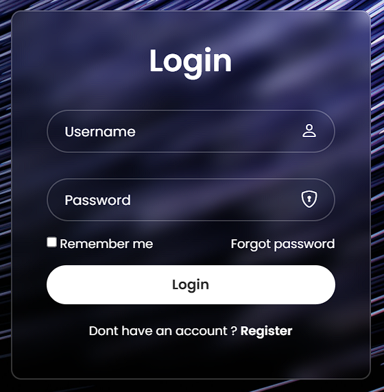

# Front-end Projects from Roadmap.sh

This repository contains front-end projects built following the [roadmap.sh](https://roadmap.sh/) front-end developer path.

## Projects List

[Single-Page CV](https://roadmap.sh/projects/single-page-cv),
[Basic HTML Website](https://roadmap.sh/projects/basic-html-website),
[Personal Portfolio](https://roadmap.sh/projects/portfolio-website),
[Changelog Component](https://roadmap.sh/projects/changelog-component),
[Testimonial Cards](https://roadmap.sh/projects/testimonial-cards),
[Datepicker UI](https://roadmap.sh/projects/datepicker-ui),
[Accessible Form UI](https://roadmap.sh/projects/accessible-form-ui),
[Image Grid Layout](https://roadmap.sh/projects/image-grid)

Click any of the images below for the live demo of the project.

  
  
  
  
   
   
   
  
