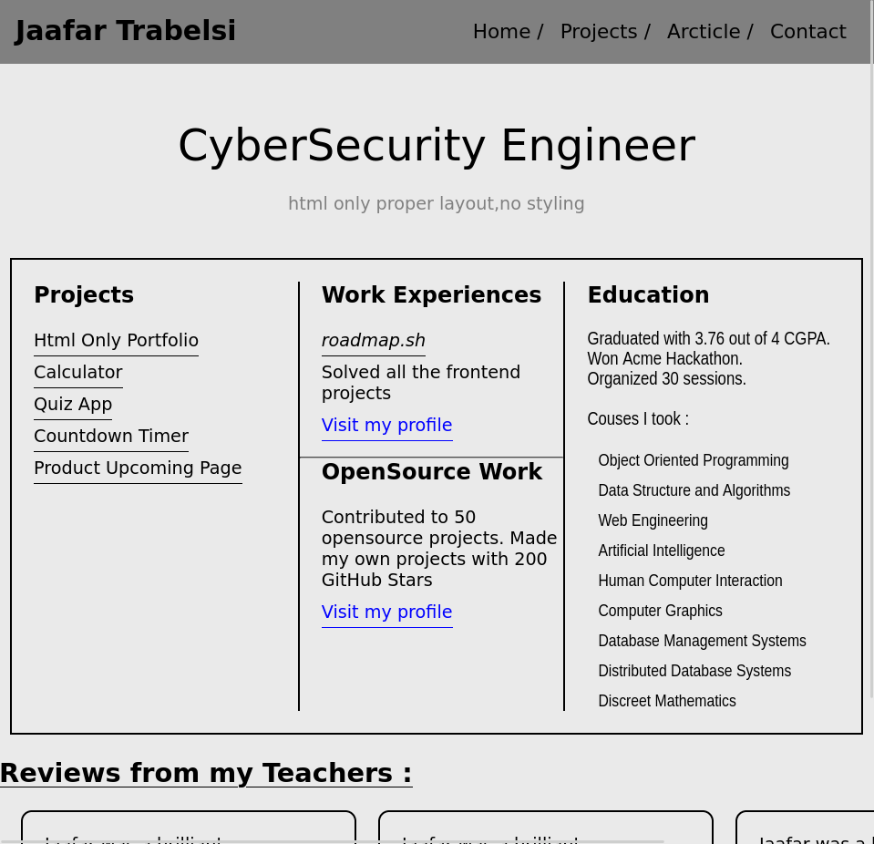
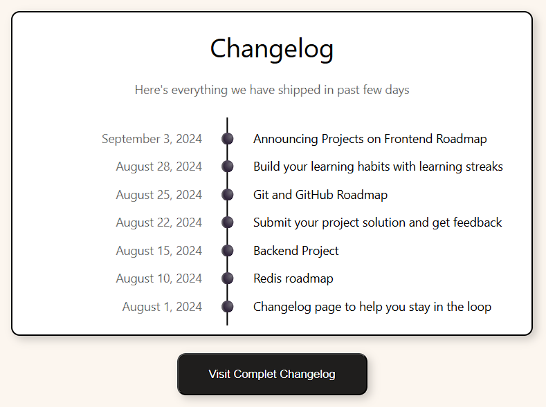
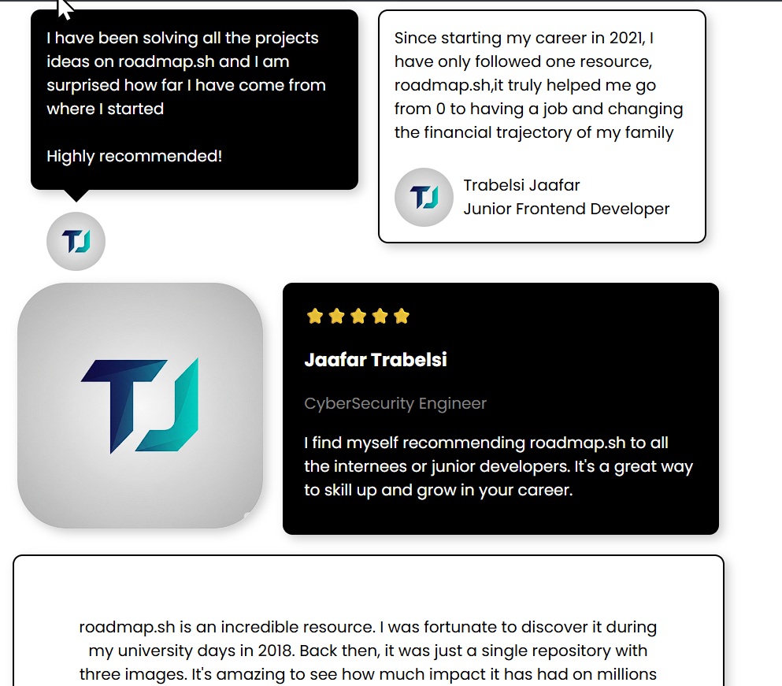
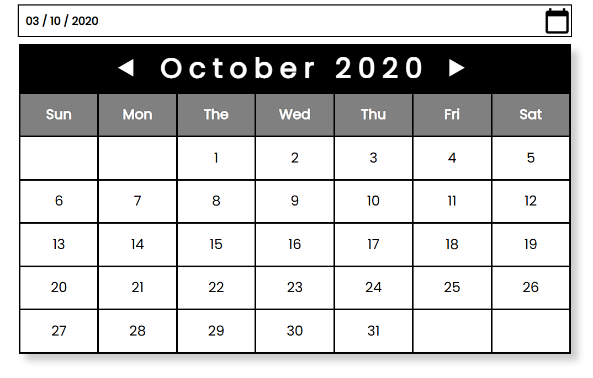
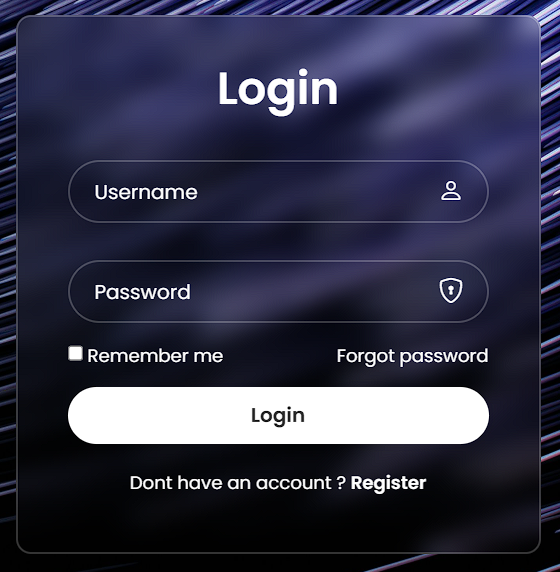
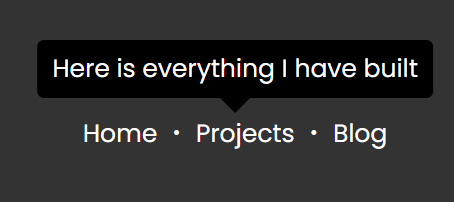

# 🚀 Front-End Projects Collection

A collection of front-end projects built by following the <a href="https://roadmap.sh/frontend">Frontend Developer Roadmap</a> from <a href="https://roadmap.sh">roadmap.sh</a>.

These projects focus on improving core front-end development skills including:

- Semantic HTML
- Modern CSS
- Responsive Design
- Accessibility
- UI Components
- Layout Techniques
- Interactive Elements

---

# 📂 Projects

| # | Project | Preview |
|---|---|---|
| 01 | <a href="https://roadmap.sh/projects/single-page-cv">Single-Page CV</a> | Personal CV webpage |
| 02 | <a href="https://roadmap.sh/projects/basic-html-website">Basic HTML Website</a> | Multi-page HTML website |
| 03 | <a href="https://roadmap.sh/projects/portfolio-website">Personal Portfolio</a> | Developer portfolio |
| 04 | <a href="https://roadmap.sh/projects/changelog-component">Changelog Component</a> | Timeline / changelog UI |
| 05 | <a href="https://roadmap.sh/projects/testimonial-cards">Testimonial Cards</a> | Responsive testimonial cards |
| 06 | <a href="https://roadmap.sh/projects/datepicker-ui">Datepicker UI</a> | Interactive datepicker |
| 07 | <a href="https://roadmap.sh/projects/accessible-form-ui">Accessible Form UI</a> | Accessible form design |
| 08 | <a href="https://roadmap.sh/projects/image-grid">Image Grid Layout</a> | CSS grid image gallery |
| 09 | <a href="https://roadmap.sh/projects/tooltip-ui">Tooltip UI</a> | Custom tooltip component |

---

# 🖼️ Project Previews

<p align="center">

<a href="frontend-projects/01-single-page-cv">
  
</a>

<a href="frontend-projects/02-basic-html-website">
  
</a>

<a href="frontend-projects/04-changelog-component">
  
</a>

<a href="frontend-projects/05-testimonial-cards">
  
</a>

<a href="frontend-projects/06-Datepicker-UI">
  
</a>

<a href="frontend-projects/07-Accessible-Form-UI">
  
</a>

<a href="frontend-projects/08-grid-layout">
  
</a>

<a href="frontend-projects/09-tooltip">
  
</a>

</p>

---

# 🛠️ Technologies Used

- HTML5
- CSS3
- JavaScript
- Flexbox
- CSS Grid
- Responsive Design Principles

---

# 🎯 Goal

The purpose of this repository is to practice and improve front-end development skills by building real-world UI projects from the roadmap.sh learning path.

---

# 📌 Repository Structure

```bash
frontend-projects/
│
├── 01-single-page-cv
├── 02-basic-html-website
├── 03-portfolio-website
├── 04-changelog-component
├── 05-testimonial-cards
├── 06-Datepicker-UI
├── 07-Accessible-Form-UI
├── 08-grid-layout
└── 09-tooltip
